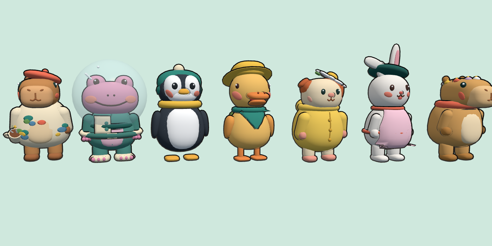

# The Sunnyfolk characters



The animals, hats, clothes and held things from the web game (`lschandler81/game`), exported as
3D models for Roblox. They're made by `tools/roblox/export.js` in that repository, so they can be
made again if the web game's characters change (see *Making them again* at the end).

## What's in `assets/characters/`

| File | What it is |
|---|---|
| `<animal>.glb` | The body of one animal: capybara, bunny, guineapig, duck, penguin, frog |
| `guineapig-grumpy.glb` | The guinea pig with the grumpy face (Chef Pepper and Dusty). Players' guinea pigs are cheerful |
| `<animal>-hats.glb` | Every hat, fitted to that animal's head |
| `<animal>-clothes.glb` | The scarf, all the clothes, and the things residents hold, fitted to that animal |
| `sunnyfolk.json` | How it all fits together: joints, colours, coats, the hat and clothes lists, and every resident with their lines |

Everything is already in **studs**, standing on the ground at the origin and facing **-Z**
(Roblox's forward). A capybara is about 5.3 studs tall.

### How each model is put together

The body is one group per moving part. These are the same parts the web game animates:

`Torso`, `Head`, `RightArm`, `LeftArm`, `RightLeg`, `LeftLeg`, `RightEye`, `LeftEye`

Each part is split into a few meshes:

- **`<Part>_<role>`**, for example `Torso_fur`, `Head_snout` or `Head_ear`. These are the
  colours that change with the animal's coat. They have no texture: set the MeshPart's `Color`.
  `sunnyfolk.json → animals.<animal>.roles` gives the default colour for each role.
  `animals.<animal>.coats` gives each coat's colours by role (Toffee, Honey, Snowy…).
- **`<Part>_detail`** is everything else: eyes, cheeks, mouths and so on. It's coloured by a
  small palette texture, so leave it as it is. It also holds the **outline**: a slightly bigger,
  inside-out copy of the shape in the dark outline colour. That gives the cartoon black edges
  with nothing else needed.
- **`<Part>_glass`** is for see-through bits (only the space bubble). Use Transparency about 0.65.

Hats are groups named by hat id (`flowers`, `beret-coral`, `chef`…), positioned where they sit
on that animal's head. Clothes and held things are groups named by id (`scarf`, `apron-pink`,
`raincoat`, `mug-right`…). Their meshes are named `<id>_<Part>_<kind>`, so `raincoat_LeftArm_detail`
belongs on the left arm. The scarf's colour mesh is `scarf_Torso_scarf`: set its `Color` to the
player's scarf colour (`sunnyfolk.json → scarves` has the choices).

Because everything was exported in the same place, a hat or piece of clothing **lines up
exactly** when the character is standing at the origin in its rest pose. Put it there, then weld
each mesh to the body part in its name.

## Bringing them into Studio

1. **Avatar** tab (or **File**) → **Import 3D**, and pick a `.glb` file.
2. In the import settings:
   - set the file's units/dimensions to **studs**, so nothing gets rescaled;
   - keep it as **one model** with its groups (don't merge the meshes).
3. Check it: the capybara should be about 5.3 studs tall, with its face looking towards -Z.
4. Put the imported models in `ReplicatedStorage.SunnyfolkModels`. Rojo leaves that folder
   alone, so the models are kept with the place (Rojo can't recreate imported meshes itself).
5. To keep a backup in this repository, right-click `SunnyfolkModels` → **Save to File** and
   save it as `.rbxm` into `assets/models/`.

`docs/roblox-studio.md` has the whole setup, step by step.

Studio uploads the meshes and the palette textures to your Roblox account as it imports. That's
normal, and they stay private to your games. The hats and clothes files are big (about 4 MB
each), so they take a minute or two.

## Making a character move

`sunnyfolk.json → animals.<animal>.pivots` gives each part's joint position, in studs, in the
character's own space. That's the neck, shoulders, hips, and where the eyes sit. The joints link
up like this (`animals.<animal>.joints`):

```
Root (HumanoidRootPart) ─┬─ Torso ─┬─ Head ─┬─ RightEye
                         │         │        └─ LeftEye
                         │         ├─ RightArm
                         │         └─ LeftArm
                         ├─ RightLeg
                         └─ LeftLeg
```

A simple way to rig it in code:

- In each part, use one mesh as the main part (`<Part>_detail` always exists). Weld the part's
  other meshes to it with `WeldConstraint`.
- Join the main parts with **Motor6D**s at the pivots: `C0` = parent:ToObjectSpace(CFrame.new(pivot)),
  `C1` = child:ToObjectSpace(CFrame.new(pivot)).
- Make the root an invisible `HumanoidRootPart`, and set the Humanoid's `HipHeight` so the feet
  touch the ground.
- Animate each frame by setting each Motor6D's `Transform`. The web game does all its animation
  in code like this, in `src/chars/animate.js`. Copy its formulas across, with **x and z
  rotations flipped in sign**: the models were turned round to face -Z, so the y rotations stay
  as they are.
  - **Walking:** the legs swing ±0.75 rad and the arms ±0.7 rad, opposite ways. The body bobs up
    to 0.09 game units (× 2.8 for studs) and waddles 0.07 rad.
  - **Standing:** the body breathes gently, and now and then the head looks around.
  - **Blinking:** every 2.5–6.5 s, squash the eye meshes to 0.12 of their height (`Size.Y`) for
    0.14 s.
  - **Talking:** the head nods quickly.
  - **Waving:** the free arm lifts about 2.4 rad sideways and wiggles.
  - **Jumping:** the arms go up, plus a little squash and stretch.
- **Sitting:** drop the body and legs 0.32 game units (0.9 studs) and swing the legs forward 1.45
  rad. `sitLift` is how far that animal's seat sits higher, in studs.

**Held things** (`sunnyfolk.json → held`): weld them to the arm in their name. Hold that arm still
at `armPose`, the shoulder angle in radians with Roblox axes. While carrying something, the arm
only swings a fifth as much when walking.

**Clothes that cover the body** (`covers: true`: raincoats, the space suit) hide the tummy patch.
Hide the `Torso_belly` mesh while they're worn.

**Residents** (`sunnyfolk.json → residents`) give each resident's:
- animal, and which body file to use (`body`);
- colours, by role;
- hat id, clothes ids, scarf colour and held things;
- size;
- everything they say (`lines`);
- where they live in the web game (`home`).

## Making them again

In the web game's repository (`lschandler81/game`):

```
npm install
python3 -m http.server 8000      # leave running
node tools/roblox/run.mjs ../sunnyfolk-roblox/assets/characters
```

It needs Playwright and a Chromium browser, the same as the web game's checks.
